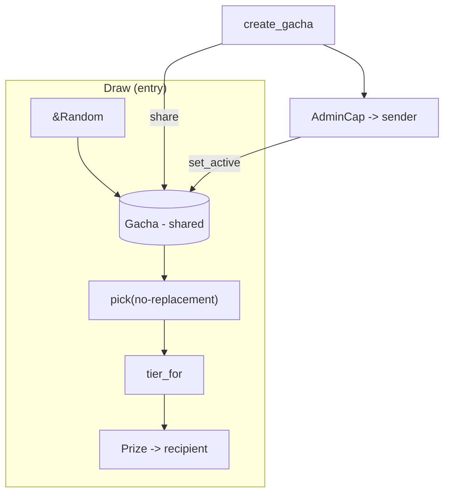

# sui_gacha

A Move-based secure gacha implementation for Sui using on-chain randomness (`sui::random`). It provides:

- Shared `Gacha` object with no-replacement selection (Fisher–Yates sparse map)
- Single-transaction secure draw using `RandomGenerator` instantiated per call
- Admin capability to toggle active state
- Unit tests under `tests/` (pure helpers for deterministic testing)

## References

- Sui Docs: On-Chain Randomness ([docs](https://docs.sui.io/guides/developer/advanced/randomness-onchain))
- Sui Framework: `sui::random` ([docs](https://docs.sui.io/references/framework/sui_sui/random))
- Move Unit Testing ([book](https://move-book.com/reference/unit-testing))

## Module Overview



### Data Structures

- `Gacha { active, remaining, total, cumulative, tier_item_ids, bucket }`
  - `cumulative`: cumulative sum per tier to map ticket -> tier
  - `tier_item_ids`: LIFO stacks of concrete item ids per tier
  - `bucket`: sparse mapping for Fisher–Yates no-replacement selection
- `AdminCap`: admin authority bound to `Gacha` object id
- `Prize`: simple object transferred to recipient on draw

### Security Notes

- Randomness is accessed via `entry fun draw(..., r: &Random, ctx: &mut TxContext)` and `rand::new_generator(r, ctx)` per Sui guidance.
- The function is `entry` and non-publicly composable with `Random` (PTB protections per Sui).
- The unhappy path does not consume more resources than the happy path.

See Sui docs for more details: [On-Chain Randomness](https://docs.sui.io/guides/developer/advanced/randomness-onchain).

## Build & Test

```bash
# build
sui move build

# run tests
sui move test
```

Current status:

- Build: OK
- Tests: 2 passed

## Example API

- `entry fun create_gacha(amounts: vector<u64>, item_ids_per_tier: vector<vector<u64>>, ctx: &mut TxContext)`
  - Shares a new `Gacha` and transfers `AdminCap` to sender
- `entry fun set_active(cap: &AdminCap, gacha: &mut Gacha, active: bool)`
- `entry fun draw(gacha: &mut Gacha, to: address, r: &Random, ctx: &mut TxContext)`


## Testing Strategy

Tests are under `tests/` and avoid constructing a `TxContext` by using test-only pure helpers:

- `test_build_cumulative` – builds cumulative sums
- `test_tier_for_wrapper` – tier mapping
- `test_pick_sequence_no_ctx` – deterministic no-replacement sequence

```bash
sui move test
```

## Notes

- The `draw` flow relies on `sui::random` and `RandomGenerator` per Sui recommendations to be secure in a single transaction.
- For production, add access control around `create_gacha` and administrative flows as needed.
